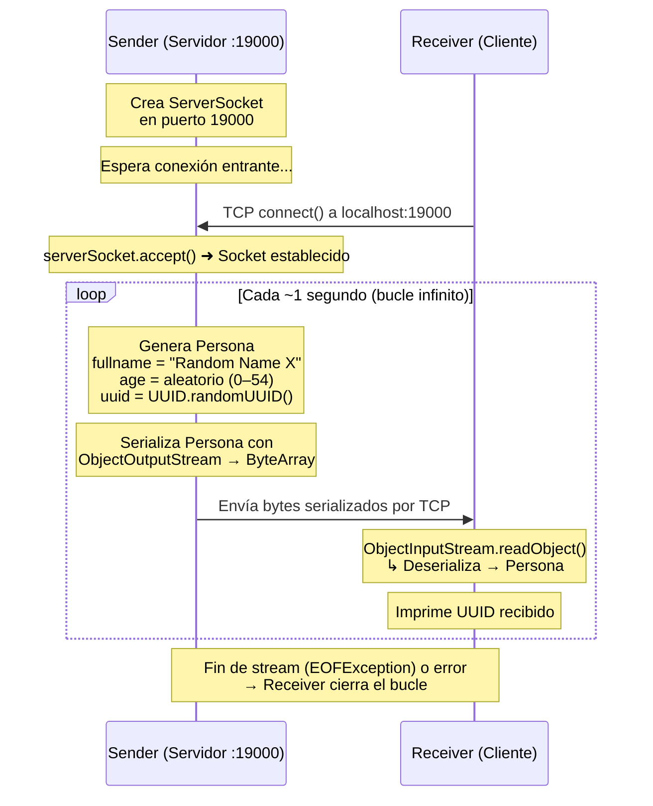
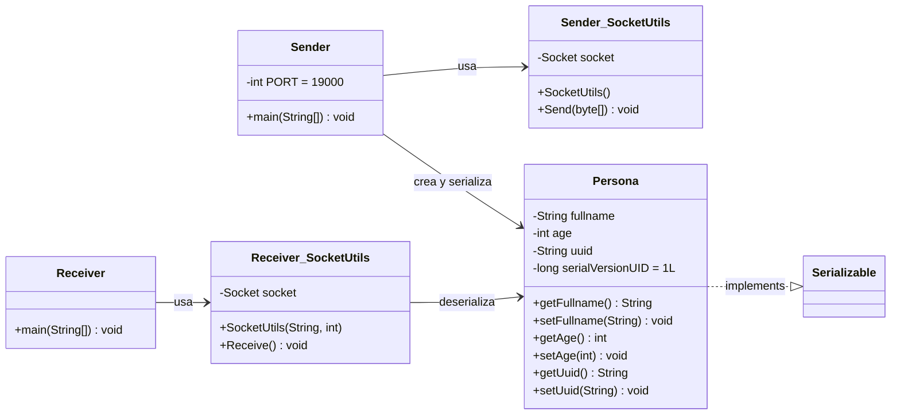
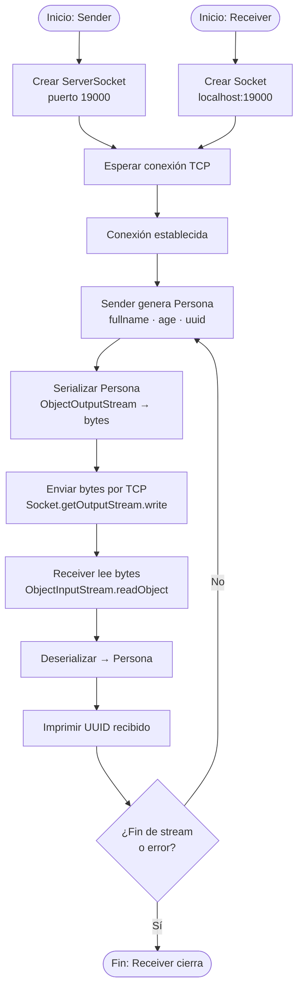

# SerializedOverNetwork — Diagrama de Funcionalidad

## Propósito del Proyecto

Este proyecto demuestra la **serialización de objetos Java y su transmisión a través de una red TCP**.  
Consiste en dos aplicaciones independientes:

- **Sender**: actúa como servidor TCP; genera objetos `Persona` con datos aleatorios, los serializa y los envía por el socket cada segundo.
- **Receiver**: actúa como cliente TCP; se conecta al servidor, recibe los bytes y los deserializa en objetos `Persona`, imprimiendo su UUID.

---

## Diagrama de Secuencia

---

## Diagrama de Clases

---

## Flujo de Datos

